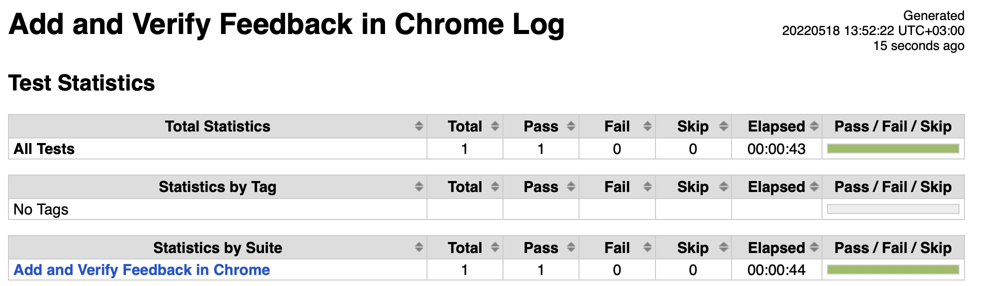
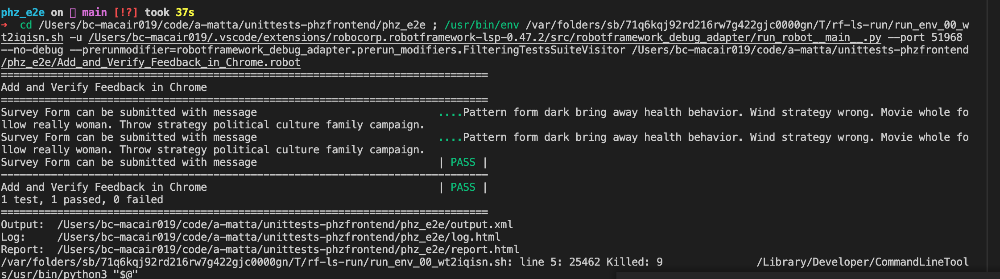

# Promoter Score Frontnend Survey Form, Backend Firebase Functions, Dashboard data retrieval

Usage:
git archive --format=tar HEAD | tar x -C ~/workspace/docker/project-name

## 1. Project Description

[Live Link](https://embedtest-mh.netlify.app/) - Survey Form
[Link to backend repo](https://github.com/martin-holland/phz_ps_backend) - Firebase Functions
[Link to Dashboard repo](https://github.com/martin-holland/ps_phz_dashboard) - Dashboard
[Testing Repo](https://github.com/a-matta/e2ephz) - End to End Testing Repo, designed to work with Survey Form, backend and Dashboard.

[Net Promoter Score](https://en.wikipedia.org/wiki/Net_promoter_score) that is widely used metric mesurement system that takes a form of single survey question asking customers to rate the likelihood that they would reccommend a company, product or service to a friend or colleague. It measures the loyalty of customers to a company. Scores are measured with a single question survey with number 1-10, a higher score is desirable.

Promoter's Call System allows buisnesses to collect customer feedback and arrive at NPS scores.

### 1.1. Business Vision

Promoter's Call System use their promoter score to measure 'customer satisfaction' & 'loyalty to a brand'. Its useful for organisations to see how customer service is percieved and where improvements might be made.

### 1.2. Task Management

We are using JIRA to manage & track our tasks, issues.

### 1.3. Personas

User research is a first step to creating a persona. By observing users, the team can understand their behavior and motivations, then create a design accordingly.

### 1.4. Use Cases

Customer 1 is asked a simple question how likely are you to reccommend this company to friend or relative?
Not at all likely 0 to extremely likely 10 based on their responses or ratings customes are placed into three categories.
Customer's feedback is expressed their views in their own words.
If 100 people answered the question so 40% - Promoters, 50% Passive and 10% Detractors
NPS = 40%-10%= 30%/100= 30

### 1.5. Non-Functional Requirements

https://wiki.phz.fi/NonFunctionalRequirements

The NPS Calculation Formula

To calculate your Net Promoter Score, subtract the percentage of Detractors from the percentage of Promoters. NPS = % promoters - % detractors. It is that simple. So, if 50% of respondents were Promoters and 10% were Detractors, your Net Promoter is a score of 40.

## 2. Architecture

### 2.1. Technologies

Dev

- React
- CSS
- Firebase
- Netlify

CI

- Currently set up to use Netlify CI. Building when changes are made to the repository with deployment testing within Github.

## 3. Development Environment

### 3.1. Prerequisites

- NodeJS 16+
- Visual Studio Code
- Firebase

### 3.2. Start the Application

npm install
npm start

### 3.3. Access the Application / Embedding

To successfully embed this project please follow the below steps:

1. Follow npm install and npm start to ensure the application runs.
2. Do npm run build
3. Inside 'build' folder you will need 3 files to host:

from static/css folder: main.randomhash.css
from static/js folder: main.randomhash.js

If you do not have an index.html or have a page for the code snippet to go into use the created index.html from the build/static/ folder.

To embed you will need:

```html
<head>
  <script defer="defer" src="./static/js/main.d27de871.js"></script>
  <link href="./static/css/main.d4dbceef.css" rel="stylesheet" />
</head>
<div id="promoterscore"></div>
```

where the src is changed to where you are hosting it from eg:

```html
<script defer="defer" src="https://embedtest-mh.netlify.app/main.js"></script>

<link href="https://embedtest-mh.netlify.app/main.css" />
```

### 3.4. Run Tests

Goto repository https://github.com/a-matta/e2ephz & clone

robot -testcasename.robot OR robot example.robot

### 3.5. IDE Setup and Debugging

Visual Code
Extensions installed

1. Eslint
2. Prettier
3. Import cost
4. Code runner
5. ES7+ React/Redux/React-Native snippets
6. Live server
7. Simple React Snippets
8. Robot Framework Language Server

### 3.6. Version Control

Survey Form https://github.com/a-matta/phz_ps
Backend https://github.com/martin-holland/phz_ps_backend
Dashboard https://github.com/martin-holland/ps_phz_dashboard
e2e tests https://github.com/a-matta/e2ephz

### 3.7. Databases and Migrations

Note: This project requires a Google account

Visit: https://console.firebase.google.com/

Steps:

1. Create a project and name it
2. Skip Analytics if you do not intend to use them.
3. Once Project is created you can click the 'Web' Option depicted as a "< / >" symbol.
4. You will need to register the app, so give it a name. Hosting is not used for this method of deployment.
5. Once created a SDK config should be displayed, the below config is what you need.

```js
const firebaseConfig = {
  apiKey: "AIzaSyBaVvjB1z1_YKHKbzxfR3JnFVHmo3C_cEL0",
  authDomain: "yourappname.firebaseapp.com",
  projectId: "yourappname",
  storageBucket: "yourappname.appspot.com",
  messagingSenderId: "322163214306",
  appId: "1:3331655514406:web:76c38d38970f3d17961ae7",
  measurementId: "G-DRJHTVD6ZW",
};
```

6. Update the Firebase config found inside src/backend/firebase-config.js
7. Go back to console from the Firebase webpage and from the left hand menu select Firestore Database
8. Create Firestore Database, you can start directly in production mode if you are combining the other 2 repositories mentioned at the top of this readme as it is a production ready application.

The rules can be left as:

```js
rules_version = '2';
service cloud.firestore {
  match /databases/{database}/documents {
    match /{document=**} {
      allow read, write: if false;
    }
  }
}
```

9. NB: **_The location cannot be changed once decided_**
   Pick the location you would like your database hosting in your region. If you are unsure where, this is normally geographically locally to the client base you will be interacting with. You can find a list of locations here:

   https://cloud.google.com/about/locations

   Make a note of this location for step 11.

   Be aware that pricing is different in different regions.

10. Once you see a table with 'Start collection' Firebase Firestore has been correctly set up.
11. Change the end point in src/backend/firebase-functions.js from

https://us-central1-promoterscore-14480.cloudfunctions.net/api/data

To: https://yourapp-location-yourapp-id.cloudfunctions.net/api/data

The app id can be found in firebase config.

12. Download the Promoterscore backend as linked from the top of this readme.
13. Inside the backend index.js change the config.js details to match those in the firebase-config you changed for this project.

14. You will need to run

```shell
firebase deploy
```

from the backend repository

15. Once these steps are completed you should be able to start hosting the site with npm start and testing it for receiving data!

### 3.8. Continuous Integration

## 4. Staging/Production Environment

### 4.1. Prerequisites

From repository https://github.com/a-matta/e2e-tests-phz, clone and

1. install Python3 & pip
2. pip install robotframework(5.0)
3. check robot version - robot --version
4. Install relevant browser drive and add to PATH. For example webdrivermanager firefox chrome --linkpath /usr/local/bin

### 4.2 Customizing Tests

1. The UI tests run with Chrome by default. To run in a different browser ensure the driver is in path and run the tests with variable override. For example to run with firefox use --variable BROWSER:firefox

### 4.3. Deployment

### 4.3. Smoke Tests

1. Form can be submitted with message.
2. Form can be sumbitted without a message.
3. Form can be closed without giving a feedback.
4. Check for validations.
5. Thankyou - must appear

#### 4.3.1. Automated Test Cases

1. Form can be submitted with message
2. Form can be sumbitted without a message
3. Form can be closed without giving a feedback

#### 4.3.2. Manual Test Cases

1. Launch Survey form at https://embedtest-mh.netlify.app, as expected survey form loads successfully is working.
2. Cross button should work as per functionality, when clicked on the Cross button the survey form should close, survey form closes sucessfully as expected.
3. Clicking on any heart should open feedback form, when heart icon is clicked feedback form can be seen.
4. Click on any heart ex. 10th,7th or 1st heart, hover should work, when any on heart icon is clicked hover is working.
5. Click on any heart without writing a feedback, when heart icon is clicked and send message is clicked, form is submitted sucessfully.
6. Add feedback and sumbit form sucessfully.
7. User cannot add special characters €#", when tried to add send button was disabled

### 4.4. Rollback

User can reset database from firebase => Go to Firebase Promoter project and Firestore database and in survey_results => delete collection. WARNING! if survey results are deleted, all test data will be deleted permenently.

### 4.5. Logs




## 5. Operating Manual

### 5.1 Manual Processes

**_Optional_**

To add manual data into firebase database for testing visit:

http://console.firebase.google.com

Steps:

1. Go to Firestore Database where you created the database from section 3.7
2. Click start collection, call collection id: survey_results
3. Click auto id for document id
4. Set up fields like this:

```js
survey_results = {
  createdAt: "2022-05-18T09:58:43.743Z",
  choice: 10,
  message: "",
  surveyResult: "promoter",
};
```

- createdAt is type string. Format is an ISOString [Read more](https://developer.mozilla.org/en-US/docs/Web/JavaScript/Reference/Global_Objects/Date/toISOString)
- choice is a number
- message can be empty, but its type is string.
- surveyResult is a string and should be either: "promoter" "detractor" or "passive"

5. This will allow you to add data to the database manually for testing.

## 6. Problems

During testing we had problems in different browsers font looked different in windows machine.

### 6.1. Environments

During testing we had issue related to cookie while using mobile phone.

### 6.2 Notable Dependancies:

- axios
- dayjs
- firebase 9.6.10
- license-to-fail 4.0.0
- react-icons 4.3.1
